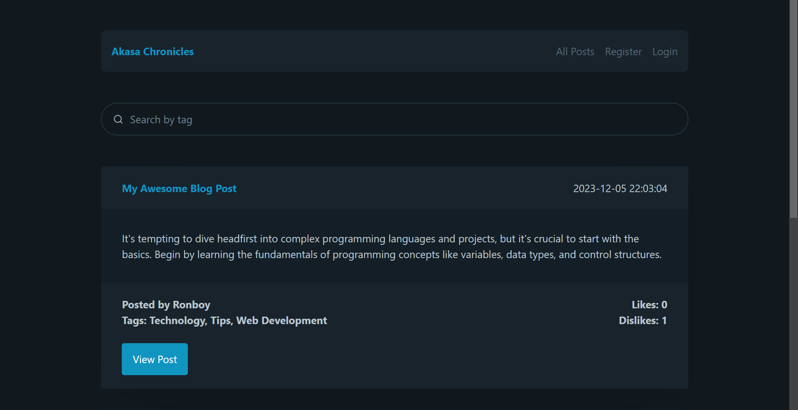

# ✍🏻 Akasa Chronicles - Share your notions

<br>
<div align="center">
  <a href="https://github.com/aaronDev28/akasa-chronicles-blog.git">
    
  </a>
</div>
<br>
<b>Github Link:</b> https://github.com/aaronDev28/akasa-chronicles-blog/tree/main<br><br>
<b>Hosted Link:</b> https://jibruu.pythonanywhere.com/


## Introduction

Akasa Chronicles is a Flask-based blogging platform designed to provide a simple yet feature-rich environment for users to create, publish, and manage blog posts. This platform supports user registration, authentication, blog post creation and management, public display of posts, and a user-friendly interface.

## Features

<b>1. User Registration and Authentication</b>

- User Registration: Users can register using their name, email, and password.
- Secure Login: Only registered users can log in to the platform.

<b>2. Create and Manage Blog Posts</b>
- Blog Post Creation: Logged-in users can create new blog posts with a title, content (max 300 words), and optional tags.
- View and Edit Posts: Users can view and edit their own posts.
- Delete Posts: Users have the option to delete their posts.
- View All Posts: All users can see all posts on the platform.

<b>3. Public Blog Display</b>
- Viewing Posts: All published blog posts are visible to visitors, ordered by the latest posts.
- Search Functionality: Users can search for blog posts based on tags.
- Like/Dislike Feature: Posts can be liked or disliked, with the count visible to all.
- Live Updates: Users receive email notifications when new blog posts are made.

<b>4. Security and Validation</b>
- CSRF Protection: The platform uses CSRF tokens to protect against cross-site request forgery attacks.
- Input Form Validation: All input forms are validated to ensure the integrity and security of the data entered by users.
- Password Hashing: Passwords are securely hashed, ensuring data protection.

<b>5. User Interface and Design</b>
- Responsive Interface: The platform offers a user-friendly and responsive interface with relevant pages for different functionalities.
- Styling with PicoCSS: The UI is styled using PicoCSS, ensuring a modern and clean aesthetic, while being responsive.

 
## Technologies Used

<b>
* Language: Python<br>
* Framework: Flask<br>
* Styling: PicoCSS<br>
* Deployment: Deployed using PythonAnywhere<br>
* Database: MySQL, integrated within PythonAnywhere<br>
</b>

### Libraries and Dependencies:

- Flask
- Flask-Login
- Flask-Mail
- Flask-SQLAlchemy
- Flask-WTF
- greenlet
- idna
- itsdangerous
- Jinja2
- MarkupSafe
- PyMySQL
- SQLAlchemy
- typing_extensions
- Werkzeug
- WTForms
- blinker
- click
- dnspython
- email-validator

The exact versions of the libraries can be seen in the requirements.txt file.

## Setting Up and Running the Application

#### Prerequisites
- Python 3.10
- MySQL Database
- Access to a SMTP server for mailing functionalities (e.g., Google SMTP)

### Installation Steps

<b>1. Clone the Repository</b>:

``` git clone https://github.com/aaronDev28/akasa-chronicles-blog.git  ```

<b>2. Set Up a Virtual Environment (Optional but recommended)</b>:

```
python -m venv venv
source venv/bin/activate  # For Unix or MacOS
venv\Scripts\activate  # For Windows
```

<b>3. Install Required Packages</b>:

``` pip install -r requirements.txt ```

<b>4. Configure the Application</b>:

- Set up the database URI in ``` app.config['SQLALCHEMY_DATABASE_URI'] ``` in app.py.
- Configure the mail server settings in ```app.config``` in app.py.
- Set a secret key for the application in ``` app.config['SECRET_KEY'] ```.

<b>5. Initialize the Database</b>:

Run Python shell and execute the following:
```
from app import app, db
with app.app_context():
  db.create_all()
```

<b>6. Run the Application</b>:
```
flask run
```

Access the application via localhost:5000 or the configured port.

## Usage

- <b>User Registration</b>: Access the registration page to create a new account.
- <b>Login</b>: Use the login page to access your account.
- <b>Create/Edit/Delete Post</b>: Logged-in users can manage create, edit and delete their own posts.
- <b>View All Posts</b>: Browse the platform to read others and own blog posts.
- <b>View Own Posts</b>: Browse the platform to read and edit only own blog posts.
- <b>Like/Dislike</b>: Interact with posts by liking or disliking them.
- <b>Search Posts</b>: Use the search functionality to find posts by tags.

## Future Enhancement
If given more time to enhance Akasa Chronicles, several additional features and improvements could be considered:
-	<b>Rich Text Editor for Posts</b>: Implementing a advanced editor (like CKEditor) would allow users to format their posts better, including options for text styling, embedding images, links, etc.
-	<b>Comment System</b>: Introducing a comment section for each blog post for more reader engagement and interaction, allowing users to leave feedback and start discussions.
-	<b>User Profile Customization</b>: Allowing users to customize their profile with a bio, profile picture, and other information.
-	<b>Analytics for Authors</b>: Providing authors with analytics on their posts, such as views, likes, and comments.
-	<b>Subscription and Notification System</b>: Implementing a subscription system where readers can subscribe to their favorite authors and get notified about new posts from only them.
-	<b>API Development</b>: Creating an API for the platform that would allow third-party integrations and extend the functionality of the platform.


# References
[1] https://flask.palletsprojects.com/en/3.0.x/ <br><br>
[2] https://pythonhosted.org/Flask-Mail/ <br><br>
[3] https://help.pythonanywhere.com/pages/Flask/ <br><br>
[4] https://www.youtube.com/watch?v=qGOmtF5fUOU (PythonAnyWhere MySQL Database Connection Setup) <br><br>
[5] https://www.youtube.com/watch?v=nOkpTwPvDTg&t (Sending Emails with Flask) <br><br>
[6] https://flask-sqlalchemy.palletsprojects.com/en/3.1.x/ <br><br>
[7] https://flask-wtf.readthedocs.io/en/1.2.x/ <br><br>
[8] https://werkzeug.palletsprojects.com/en/3.0.x/ <br>
